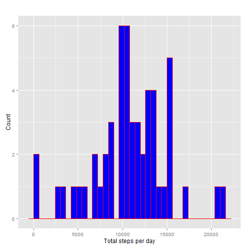
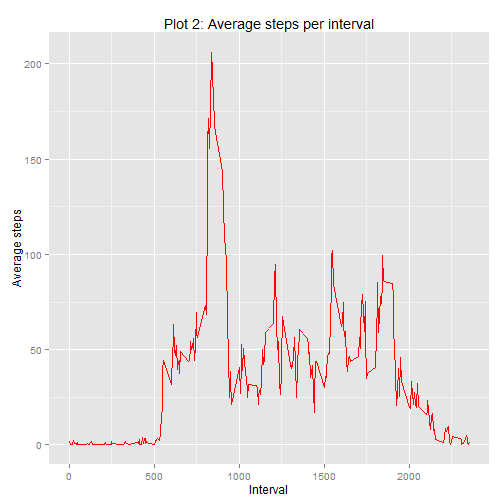
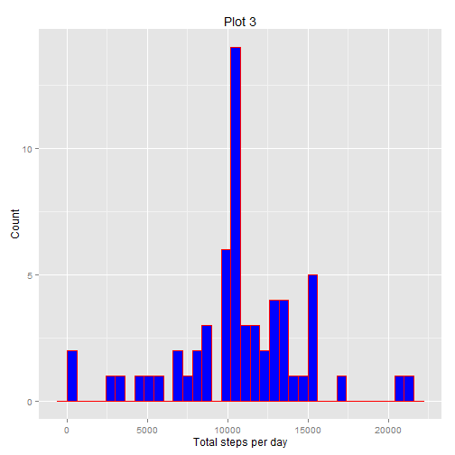
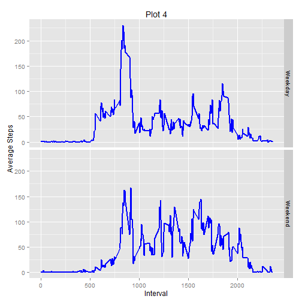

##1. Loading and preprocessing the data
Ensure the relevant libraries are loaded. For this research, the following libraries are used: **knitr**, **dplyr** and **ggplot2**.

```r
library(dplyr)
library(ggplot2)
library(dplyr)
```
Read data set as dataframe ***df***. 

```r
df <- read.csv("repdata-data-activity/activity.csv", header = TRUE)
```
View summary (**summary**),structure (**str**) and sample data (**head**) of dataframe.

```r
summary(df)
```

```
##      steps                date          interval     
##  Min.   :  0.00   2012-10-01:  288   Min.   :   0.0  
##  1st Qu.:  0.00   2012-10-02:  288   1st Qu.: 588.8  
##  Median :  0.00   2012-10-03:  288   Median :1177.5  
##  Mean   : 37.38   2012-10-04:  288   Mean   :1177.5  
##  3rd Qu.: 12.00   2012-10-05:  288   3rd Qu.:1766.2  
##  Max.   :806.00   2012-10-06:  288   Max.   :2355.0  
##  NA's   :2304     (Other)   :15840
```

```r
str(df)
```

```
## 'data.frame':	17568 obs. of  3 variables:
##  $ steps   : int  NA NA NA NA NA NA NA NA NA NA ...
##  $ date    : Factor w/ 61 levels "2012-10-01","2012-10-02",..: 1 1 1 1 1 1 1 1 1 1 ...
##  $ interval: int  0 5 10 15 20 25 30 35 40 45 ...
```

```r
head(df)
```

```
##   steps       date interval
## 1    NA 2012-10-01        0
## 2    NA 2012-10-01        5
## 3    NA 2012-10-01       10
## 4    NA 2012-10-01       15
## 5    NA 2012-10-01       20
## 6    NA 2012-10-01       25
```
Note that there are 2304 NAs in ***steps*** column as shown in summary.


##2. What is mean total number of steps taken per day?
Remove the NAs by selecting complete cases only. Removal of NAs via **complete.cases()** results in 15,264 rows in ***df.complete***. This corresponds with 17,568 rows in original dataset (***df***) minus 2,304 NAs.

```r
df.complete <- df[complete.cases(df),]
nrow(df.complete)
```

```
## [1] 15264
```
Select columns 1 (*steps*) and 2 (*date*) for the purpose of answering this question.

```r
df.complete.step.date <- df.complete[,c(1,2)]
```
Convert to **tbl_df** class of **dplyr**.

```r
tbl <- tbl_df(df.complete.step.date)
```
Calculate the sum of steps and name the column as ***totalsteps***. The sum is grouped by ***date***.

```r
tbl.sumdate <- tbl %>% group_by(date) %>% summarise(totalsteps = sum(steps))
```
The total steps per day as shown in ***tbl.sumdate*** is as follows:

```r
knitr::kable(tbl.sumdate)
```


|date       | totalsteps|
|:----------|----------:|
|2012-10-02 |        126|
|2012-10-03 |      11352|
|2012-10-04 |      12116|
|2012-10-05 |      13294|
|2012-10-06 |      15420|
|2012-10-07 |      11015|
|2012-10-09 |      12811|
|2012-10-10 |       9900|
|2012-10-11 |      10304|
|2012-10-12 |      17382|
|2012-10-13 |      12426|
|2012-10-14 |      15098|
|2012-10-15 |      10139|
|2012-10-16 |      15084|
|2012-10-17 |      13452|
|2012-10-18 |      10056|
|2012-10-19 |      11829|
|2012-10-20 |      10395|
|2012-10-21 |       8821|
|2012-10-22 |      13460|
|2012-10-23 |       8918|
|2012-10-24 |       8355|
|2012-10-25 |       2492|
|2012-10-26 |       6778|
|2012-10-27 |      10119|
|2012-10-28 |      11458|
|2012-10-29 |       5018|
|2012-10-30 |       9819|
|2012-10-31 |      15414|
|2012-11-02 |      10600|
|2012-11-03 |      10571|
|2012-11-05 |      10439|
|2012-11-06 |       8334|
|2012-11-07 |      12883|
|2012-11-08 |       3219|
|2012-11-11 |      12608|
|2012-11-12 |      10765|
|2012-11-13 |       7336|
|2012-11-15 |         41|
|2012-11-16 |       5441|
|2012-11-17 |      14339|
|2012-11-18 |      15110|
|2012-11-19 |       8841|
|2012-11-20 |       4472|
|2012-11-21 |      12787|
|2012-11-22 |      20427|
|2012-11-23 |      21194|
|2012-11-24 |      14478|
|2012-11-25 |      11834|
|2012-11-26 |      11162|
|2012-11-27 |      13646|
|2012-11-28 |      10183|
|2012-11-29 |       7047|
  
Build histogram of ***totalsteps*** which represents total steps per day.


```r
ggplot(tbl.sumdate,aes(totalsteps))+geom_histogram(binwidth=600,colour="red",fill="blue") + labs(title= "Plot 1",y="Count",x="Total steps per day")
```

 

Based on plot above, total steps per day with highest counts are at around 10,000 steps. The distribution is similar to normal distribution except for high count for 0 steps and the high count for around 15,000 steps.
  
Calculate mean of steps per day using **mean()**

```r
prettyNum(mean(tbl.sumdate$totalsteps))
```

```
## [1] "10766.19"
```
mean steps per day is **10766.19**
  
Calculate median of steps per date using **median()**   

```r
prettyNum(median(tbl.sumdate$totalsteps))
```

```
## [1] "10765"
```
median for steps per day is **10765**


##3. What is the average daily activity pattern?

Using the dataframe ***df.complete*** (NAs removed), select the relevant columns (1 and 3), which are ***steps*** and ***interval*** and convert the resulting dataframe ***df.complete.step.interval*** into **tbl_df** form

```r
df.complete.step.interval <-df.complete[,c(1,3)]
tbl2 <- tbl_df(df.complete.step.interval)
```
Calculate the mean for steps using **mean()** and name the column as ***meansteps***. The mean value is grouped by ***interval***.

```r
tbl.suminterval <- tbl2 %>% group_by(interval) %>% summarise(meansteps = mean(steps))
```

Build line plot of average steps per interval across all days.

```r
ggplot(tbl.suminterval,aes(x=interval,y=meansteps)) +geom_line(color="red") + labs(title="Plot 2: Average steps per interval",x="Interval",y="Average steps")
```

 

Based on the plot above, the average daily pattern indicates 0 or minimal steps from 0000 to 0500hours, followed by  a sharp increase in steps between 0730 and 1000hours, peaking at over 200 steps. Beyond that, there is erratic steps averaging between 25 to 100 steps from 1000 to 2000hours, and tapers off at end of day.

Find the highest average step using **which.max()** and extract the row into new table

```r
max_interval <- tbl.suminterval[which.max(tbl.suminterval$meansteps),]
max_interval
```

```
## Source: local data frame [1 x 2]
## 
##   interval meansteps
## 1      835  206.1698
```
the maximum steps occur for interval **835** which is **206.1698** steps.

##4. Imputing missing values
Summary of ***df*** showed that only ***steps*** column had NAs (refer part 1 above). This is confirmed by checking the existence of NAs for each column using **is.na()** and doing a **sum()** of it. Any value more than 0 will indicate existence of NAs.

```r
sum(is.na(df$steps))
```

```
## [1] 2304
```

```r
sum(is.na(df$date))
```

```
## [1] 0
```

```r
sum(is.na(df$interval))
```

```
## [1] 0
```
Based on above, our concern now is the 2,304 NAs in ***steps*** column. To fill the NA with suitable value, a strategy of using the average of its associated interval is used. For example, an NA for interval 1300hours will be filled with average of non-NA steps for all 1300hours. The reason for this strategy is the assumption that a person will be most likely doing the same activity at the same time of the day (example, sleeping at night, going to work in the morning, going out for lunch and so on).

Create a copy of the original data frame and name it ***df.filled***.

```r
df.filled <-df
```

Identify the position of NAs and store in a logical vector ***nas***.

```r
nas <- is.na(df.filled$steps)
```

Calculate the average steps for every interval, not including the NAs (via **na.rm=TRUE**), using **tapply()** and **mean**, and store in vector ***avg_interval***.

```r
avg_interval <- tapply(df.filled$steps,df.filled$interval,mean,na.rm=TRUE,simplify = TRUE)
```
Using the logical vector ***nas***, find the interval using **as.character(df.filled$interval[nas])**. Then, using the interval as index for ***avg_interval***, retrieve the appropriate average and replace the corresponding NA in ***df.filled*** based on logical position from ***nas***.

```r
df.filled$steps[nas] <- avg_interval[as.character(df.filled$interval[nas])]
```
Do a check to see if NAs still exist. if **sum()** returns zero, then all NAs has been successfully replaced.

```r
sum(is.na(df.filled$steps))
```

```
## [1] 0
```
Since sum is 0, the NAs has been replaced.

The processes under part 2 above is repeated using data frame with filled-in values for NAs, ***df.filled***.
  
Select the required columns 1 and 2 which are ***steps*** and ***date***, and create dataframe ***df.filled.step.date***. Convert it to **tbl_df** format.

```r
df.filled.step.date <- df.filled[,c(1,2)]
tbl.filled <- tbl_df(df.filled.step.date)
```


Calculate the sum of steps and name the column as ***totalsteps***. The sum is grouped by ***date***.

```r
tbl.filled.sumdate <- tbl.filled %>% group_by(date) %>% summarise(totalsteps = sum(steps))
```

Build histogram of ***totalsteps*** which represents total steps per day.

```r
ggplot(tbl.filled.sumdate,aes(totalsteps))+geom_histogram(binwidth=600,colour="red",fill="blue") + labs(title= "Plot 3",y="Count",x="Total steps per day")
```

 

Calculate mean of steps per day using **mean()**

```r
prettyNum(mean(tbl.filled.sumdate$totalsteps))
```

```
## [1] "10766.19"
```
mean steps per day is **10766.19**
  
Calculate median of steps per date using **median()**   

```r
prettyNum(median(tbl.filled.sumdate$totalsteps))
```

```
## [1] "10766.19"
```
median for steps per day is **10766.19**

Comparing mean for NA-removed dataset and filled-in dataset reveals that both have the same mean value of **10766.19**. This is possibly due to the filled-in values being calculated using mean of other steps thus returning the same overall mean.

As for median, NA-removed dataset yielded median of **10765** while filled-in dataset yielded median of **10766.19** which is a minute difference of **1.19**. Again, due to use of mean according to average of steps per interval to fill-in the NAs, the impact is minimal and insignificant.

The number of days for NA-removed dataset and filled-in dataset are as follows:

```r
nrow(tbl.sumdate)
```

```
## [1] 53
```

```r
nrow(tbl.filled.sumdate)
```

```
## [1] 61
```
There is an additional 9 days after NA's has been filled-in. This represents nearly 17% increase over the NA-removed 53 days, but due to filling up with mean values of total steps per interval, the mean and median are of filled-in dataset is not significantly impacted.


## Are there differences in activity patterns between weekdays and weekends?
In order to answer the question, we need create a day type column to identify whether a date is weekday or a weekend.

Create a copy of filled-in missing values dataset.

```r
df.filled.week <- df.filled
```
Create new column ***DayType*** which keeps day value of corresponding date.

```r
df.filled.week$DayType <- factor(weekdays(as.Date(df.filled.week$date)))
```
Create level of 2 types (Weekday,Weekend) for the new column and replace the day with appropriate level.

```r
levels(df.filled.week$DayType) <- list(
  Weekday = c("Monday","Tuesday","Wednesday","Thursday","Friday"),
  Weekend = c("Sunday","Saturday")
)
```
Convert the dataframe to  **tbl_df** format.

```r
tbl.week <- tbl_df(df.filled.week)
```

Calculate the average steps, grouped by ***interval*** and ***DayType*** and store in ***tbl.week.sum***.

```r
tbl.week.sum <- tbl.week %>% group_by(interval,DayType) %>% summarise(avgsteps = mean(steps))
```

Create panel plot by utilising **facet_grid()** to generate two line plots based on ***DayType***.

```r
ggplot(tbl.week.sum,aes(x=interval,y=avgsteps)) + geom_line(color="blue", size = 1) + facet_grid(DayType ~ .) +  labs(title= "Plot 4",y="Average Steps",x="Interval")
```

 

According to the plots above, both weekday dan weekend patterns are similar with peaks between 0700 and 1000hours. However, the steps for weekend are more evenly spread from 0700 to 2000hours, ranging from 25 to around 150 steps. For weekdays, excluding the spike between 0730 and 1000hours, from 1000 to 2000hours sees average steps ranging from 25 to 125 steps.

Following are comparison of  max, min, mean and median for weekdays and weekend.

Calculate interval with maximum average steps for weekday and weekend by first filtering by ***DayType*** and then using **which.max()**.

```r
max_step_weekday <- tbl.week.sum[tbl.week.sum$DayType == "Weekday",]
max_step_weekday <- max_step_weekday[which.max(max_step_weekday$avgsteps),]
max_step_weekday
```

```
## Source: local data frame [1 x 3]
## Groups: interval
## 
##   interval DayType avgsteps
## 1      835 Weekday 230.3782
```

```r
max_step_weekend <- tbl.week.sum[tbl.week.sum$DayType == "Weekend",]
max_step_weekend <- max_step_weekend[which.max(max_step_weekend$avgsteps),]
max_step_weekend
```

```
## Source: local data frame [1 x 3]
## Groups: interval
## 
##   interval DayType avgsteps
## 1      915 Weekend 166.6392
```
For weekday, interval **835** has maximum average steps of **230.3781971**.
For weekend, interval **915** has maximum average steps of **166.6391509**.


```r
min_step_weekday <- tbl.week.sum[tbl.week.sum$DayType == "Weekday",]
min_step_weekday <- min_step_weekday[which.min(min_step_weekday$avgsteps),]

min_step_weekend <- tbl.week.sum[tbl.week.sum$DayType == "Weekend",]
min_step_weekend <- min_step_weekend[which.min(min_step_weekend$avgsteps),]
```


```r
mean_step_weekday <- tbl.week.sum[tbl.week.sum$DayType == "Weekday",]
mean(mean_step_weekday$avgsteps)
```

```
## [1] 35.61058
```

```r
mean_step_weekend <- tbl.week.sum[tbl.week.sum$DayType == "Weekend",]
mean(mean_step_weekend$avgsteps)
```

```
## [1] 42.3664
```


```r
median_step_weekday <- tbl.week.sum[tbl.week.sum$DayType == "Weekday",]
median(median_step_weekday$avgsteps)
```

```
## [1] 25.80314
```

```r
median_step_weekend <- tbl.week.sum[tbl.week.sum$DayType == "Weekend",]
median(median_step_weekend$avgsteps)
```

```
## [1] 32.33962
```


